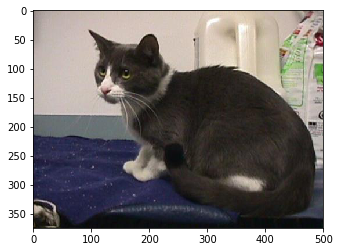
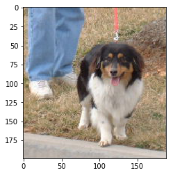
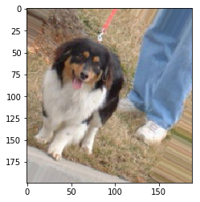
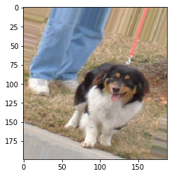
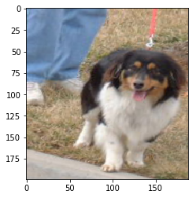
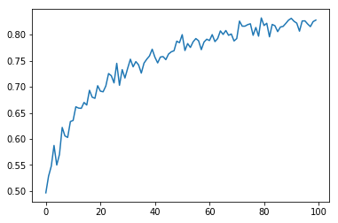

```python
import matplotlib.pyplot as plt
import cv2
# Technically not necessary in newest versions of jupyter
%matplotlib inline
```


```python
cat4 = cv2.imread('../DATA/CATS_DOGS/train/CAT/4.jpg')
cat4 = cv2.cvtColor(cat4,cv2.COLOR_BGR2RGB)
```


```python
type(cat4)
```


    numpy.ndarray


```python
cat4.shape
```


    (375, 500, 3)


```python
plt.imshow(cat4)
```


    <matplotlib.image.AxesImage at 0x1575e7bd4e0>





```python
dog2 = cv2.imread('../DATA/CATS_DOGS/train/Dog/2.jpg')
dog2 = cv2.cvtColor(dog2,cv2.COLOR_BGR2RGB)
```


```python
dog2.shape
```


    (199, 188, 3)


```python
plt.imshow(dog2)
```


    <matplotlib.image.AxesImage at 0x1575e883048>





```python
from keras.preprocessing.image import ImageDataGenerator
```

    Using TensorFlow backend.


```python
image_gen = ImageDataGenerator(rotation_range=30, # rotate the image 30 degrees
                               width_shift_range=0.1, # Shift the pic width by a max of 10%
                               height_shift_range=0.1, # Shift the pic height by a max of 10%
                               rescale=1/255, # Rescale the image by normalzing it.
                               shear_range=0.2, # Shear means cutting away part of the image (max 20%)
                               zoom_range=0.2, # Zoom in by 20% max
                               horizontal_flip=True, # Allo horizontal flipping
                               fill_mode='nearest' # Fill in missing pixels with the nearest filled value
                              )
```


```python
plt.imshow(image_gen.random_transform(dog2))
```


    <matplotlib.image.AxesImage at 0x1576422a7b8>





```python
plt.imshow(image_gen.random_transform(dog2))
```


    <matplotlib.image.AxesImage at 0x157642846a0>





```python
plt.imshow(image_gen.random_transform(dog2))
```


    <matplotlib.image.AxesImage at 0x157642dc6d8>





```python
image_gen.flow_from_directory('../DATA/CATS_DOGS/train')
```

    Found 18743 images belonging to 2 classes.


    <keras_preprocessing.image.DirectoryIterator at 0x15e9b9095c0>


```python
image_gen.flow_from_directory('../DATA/CATS_DOGS/test')
```

    Found 6251 images belonging to 2 classes.


    <keras_preprocessing.image.DirectoryIterator at 0x15e9b9e7048>


```python
# width,height,channels
image_shape = (150,150,3)
```

# Creating the Model


```python
from keras.models import Sequential
from keras.layers import Activation, Dropout, Flatten, Dense, Conv2D, MaxPooling2D
```


```python
model = Sequential()

model.add(Conv2D(filters=32, kernel_size=(3,3),input_shape=(150,150,3), activation='relu',))
model.add(MaxPooling2D(pool_size=(2, 2)))

model.add(Conv2D(filters=64, kernel_size=(3,3),input_shape=(150,150,3), activation='relu',))
model.add(MaxPooling2D(pool_size=(2, 2)))

model.add(Conv2D(filters=64, kernel_size=(3,3),input_shape=(150,150,3), activation='relu',))
model.add(MaxPooling2D(pool_size=(2, 2)))


model.add(Flatten())


model.add(Dense(128))
model.add(Activation('relu'))

# Dropouts help reduce overfitting by randomly turning neurons off during training.
# Here we say randomly turn off 50% of neurons.
model.add(Dropout(0.5))

# Last layer, remember its binary, 0=cat , 1=dog
model.add(Dense(1))
model.add(Activation('sigmoid'))

model.compile(loss='binary_crossentropy',
              optimizer='adam',
              metrics=['accuracy'])
```


```python
model.summary()
```

    _________________________________________________________________
    Layer (type)                 Output Shape              Param #   
    =================================================================
    conv2d_1 (Conv2D)            (None, 148, 148, 32)      896       
    _________________________________________________________________
    max_pooling2d_1 (MaxPooling2 (None, 74, 74, 32)        0         
    _________________________________________________________________
    conv2d_2 (Conv2D)            (None, 72, 72, 64)        18496     
    _________________________________________________________________
    max_pooling2d_2 (MaxPooling2 (None, 36, 36, 64)        0         
    _________________________________________________________________
    conv2d_3 (Conv2D)            (None, 34, 34, 64)        36928     
    _________________________________________________________________
    max_pooling2d_3 (MaxPooling2 (None, 17, 17, 64)        0         
    _________________________________________________________________
    flatten_1 (Flatten)          (None, 18496)             0         
    _________________________________________________________________
    dense_1 (Dense)              (None, 128)               2367616   
    _________________________________________________________________
    activation_1 (Activation)    (None, 128)               0         
    _________________________________________________________________
    dropout_1 (Dropout)          (None, 128)               0         
    _________________________________________________________________
    dense_2 (Dense)              (None, 1)                 129       
    _________________________________________________________________
    activation_2 (Activation)    (None, 1)                 0         
    =================================================================
    Total params: 2,424,065
    Trainable params: 2,424,065
    Non-trainable params: 0
    _________________________________________________________________


### Training the Model


```python
batch_size = 16

train_image_gen = image_gen.flow_from_directory('../DATA/CATS_DOGS/train',
                                               target_size=image_shape[:2],
                                               batch_size=batch_size,
                                               class_mode='binary')
```

    Found 18743 images belonging to 2 classes.


```python
test_image_gen = image_gen.flow_from_directory('../DATA/CATS_DOGS/test',
                                               target_size=image_shape[:2],
                                               batch_size=batch_size,
                                               class_mode='binary')
```

    Found 6251 images belonging to 2 classes.


```python
train_image_gen.class_indices
```


    {'CAT': 0, 'DOG': 1}


```python
import warnings
warnings.filterwarnings('ignore')
```


```python
results = model.fit_generator(train_image_gen,epochs=100,
                              steps_per_epoch=150,
                              validation_data=test_image_gen,
                             validation_steps=12)
```

    Epoch 1/100
    150/150 [==============================] - 75s 499ms/step - loss: 0.6992 - acc: 0.4967 - val_loss: 0.6930 - val_acc: 0.5002
    Epoch 2/100
    150/150 [==============================] - 53s 354ms/step - loss: 0.6912 - acc: 0.5272 - val_loss: 0.6734 - val_acc: 0.5354
    Epoch 3/100
    150/150 [==============================] - 54s 361ms/step - loss: 0.6820 - acc: 0.5479 - val_loss: 0.6787 - val_acc: 0.5821
    Epoch 4/100
    150/150 [==============================] - 54s 359ms/step - loss: 0.6728 - acc: 0.5875 - val_loss: 0.6579 - val_acc: 0.5937
    Epoch 5/100
    150/150 [==============================] - 54s 357ms/step - loss: 0.6781 - acc: 0.5500 - val_loss: 0.6864 - val_acc: 0.5324
    Epoch 6/100
    150/150 [==============================] - 53s 350ms/step - loss: 0.6716 - acc: 0.5704 - val_loss: 0.6364 - val_acc: 0.6170
    Epoch 7/100
    150/150 [==============================] - 52s 347ms/step - loss: 0.6632 - acc: 0.6221 - val_loss: 0.6631 - val_acc: 0.5498
    Epoch 8/100
    150/150 [==============================] - 53s 352ms/step - loss: 0.6497 - acc: 0.6058 - val_loss: 0.6321 - val_acc: 0.6290
    Epoch 9/100
    150/150 [==============================] - 46s 306ms/step - loss: 0.6554 - acc: 0.6029 - val_loss: 0.6051 - val_acc: 0.6687
    Epoch 10/100
    150/150 [==============================] - 43s 285ms/step - loss: 0.6296 - acc: 0.6333 - val_loss: 0.6284 - val_acc: 0.6596
    Epoch 11/100
    150/150 [==============================] - 44s 296ms/step - loss: 0.6357 - acc: 0.6354 - val_loss: 0.6576 - val_acc: 0.6290
    Epoch 12/100
    150/150 [==============================] - 44s 293ms/step - loss: 0.6074 - acc: 0.6617 - val_loss: 0.6166 - val_acc: 0.6562
    Epoch 13/100
    150/150 [==============================] - 44s 293ms/step - loss: 0.6151 - acc: 0.6592 - val_loss: 0.5912 - val_acc: 0.6751
    Epoch 14/100
    150/150 [==============================] - 44s 291ms/step - loss: 0.6159 - acc: 0.6595 - val_loss: 0.6257 - val_acc: 0.6794
    Epoch 15/100
    150/150 [==============================] - 44s 295ms/step - loss: 0.6151 - acc: 0.6700 - val_loss: 0.6164 - val_acc: 0.6530
    Epoch 16/100
    150/150 [==============================] - 44s 295ms/step - loss: 0.6079 - acc: 0.6650 - val_loss: 0.5767 - val_acc: 0.6988
    Epoch 17/100
    150/150 [==============================] - 42s 279ms/step - loss: 0.5829 - acc: 0.6933 - val_loss: 0.5730 - val_acc: 0.6983
    Epoch 18/100
    150/150 [==============================] - 42s 282ms/step - loss: 0.5916 - acc: 0.6802 - val_loss: 0.5865 - val_acc: 0.6844
    Epoch 19/100
    150/150 [==============================] - 41s 270ms/step - loss: 0.5920 - acc: 0.6779 - val_loss: 0.5938 - val_acc: 0.6860
    Epoch 20/100
    150/150 [==============================] - 41s 276ms/step - loss: 0.5660 - acc: 0.7021 - val_loss: 0.5418 - val_acc: 0.7194
    Epoch 21/100
    150/150 [==============================] - 41s 274ms/step - loss: 0.5828 - acc: 0.6917 - val_loss: 0.5557 - val_acc: 0.7143
    Epoch 22/100
    150/150 [==============================] - 41s 271ms/step - loss: 0.5813 - acc: 0.6904 - val_loss: 0.5456 - val_acc: 0.7156
    Epoch 23/100
    150/150 [==============================] - 40s 268ms/step - loss: 0.5785 - acc: 0.7017 - val_loss: 0.5415 - val_acc: 0.7309
    Epoch 24/100
    150/150 [==============================] - 41s 272ms/step - loss: 0.5399 - acc: 0.7254 - val_loss: 0.5219 - val_acc: 0.7448
    Epoch 25/100
    150/150 [==============================] - 40s 268ms/step - loss: 0.5581 - acc: 0.7212 - val_loss: 0.5115 - val_acc: 0.7407
    Epoch 26/100
    150/150 [==============================] - 41s 273ms/step - loss: 0.5614 - acc: 0.7075 - val_loss: 0.5712 - val_acc: 0.7005
    Epoch 27/100
    150/150 [==============================] - 43s 288ms/step - loss: 0.5324 - acc: 0.7450 - val_loss: 0.5261 - val_acc: 0.7418
    Epoch 28/100
    150/150 [==============================] - 43s 289ms/step - loss: 0.5661 - acc: 0.7029 - val_loss: 0.5322 - val_acc: 0.7383
    Epoch 29/100
    150/150 [==============================] - 43s 283ms/step - loss: 0.5320 - acc: 0.7329 - val_loss: 0.5003 - val_acc: 0.7589
    Epoch 30/100
    150/150 [==============================] - 44s 291ms/step - loss: 0.5396 - acc: 0.7163 - val_loss: 0.5002 - val_acc: 0.7533
    Epoch 31/100
    150/150 [==============================] - 45s 298ms/step - loss: 0.5503 - acc: 0.7354 - val_loss: 0.5026 - val_acc: 0.7540
    Epoch 32/100
    150/150 [==============================] - 42s 281ms/step - loss: 0.5118 - acc: 0.7529 - val_loss: 0.5139 - val_acc: 0.7452
    Epoch 33/100
    150/150 [==============================] - 43s 288ms/step - loss: 0.5234 - acc: 0.7383 - val_loss: 0.5032 - val_acc: 0.7532
    Epoch 34/100
    150/150 [==============================] - 40s 268ms/step - loss: 0.5143 - acc: 0.7483 - val_loss: 0.4953 - val_acc: 0.7586
    Epoch 35/100
    150/150 [==============================] - 40s 267ms/step - loss: 0.5204 - acc: 0.7421 - val_loss: 0.4924 - val_acc: 0.7528
    Epoch 36/100
    150/150 [==============================] - 40s 268ms/step - loss: 0.5395 - acc: 0.7262 - val_loss: 0.4933 - val_acc: 0.7573
    Epoch 37/100
    150/150 [==============================] - 40s 268ms/step - loss: 0.5138 - acc: 0.7454 - val_loss: 0.4732 - val_acc: 0.7778
    Epoch 38/100
    150/150 [==============================] - 40s 268ms/step - loss: 0.5102 - acc: 0.7529 - val_loss: 0.4892 - val_acc: 0.7573
    Epoch 39/100
    150/150 [==============================] - 40s 267ms/step - loss: 0.4887 - acc: 0.7595 - val_loss: 0.4720 - val_acc: 0.7748
    Epoch 40/100
    150/150 [==============================] - 40s 269ms/step - loss: 0.4813 - acc: 0.7713 - val_loss: 0.4918 - val_acc: 0.7613
    Epoch 41/100
    150/150 [==============================] - 40s 267ms/step - loss: 0.4975 - acc: 0.7567 - val_loss: 0.4787 - val_acc: 0.7717
    Epoch 42/100
    150/150 [==============================] - 40s 267ms/step - loss: 0.5057 - acc: 0.7458 - val_loss: 0.4649 - val_acc: 0.7776
    Epoch 43/100
    150/150 [==============================] - 40s 267ms/step - loss: 0.5008 - acc: 0.7571 - val_loss: 0.4675 - val_acc: 0.7727
    Epoch 44/100
    150/150 [==============================] - 40s 267ms/step - loss: 0.4856 - acc: 0.7579 - val_loss: 0.4909 - val_acc: 0.7655
    Epoch 45/100
    150/150 [==============================] - 40s 268ms/step - loss: 0.5097 - acc: 0.7521 - val_loss: 0.4690 - val_acc: 0.7756
    Epoch 46/100
    150/150 [==============================] - 40s 267ms/step - loss: 0.4888 - acc: 0.7629 - val_loss: 0.4651 - val_acc: 0.7776
    Epoch 47/100
    150/150 [==============================] - 40s 268ms/step - loss: 0.4847 - acc: 0.7671 - val_loss: 0.4682 - val_acc: 0.7789
    Epoch 48/100
    150/150 [==============================] - 40s 267ms/step - loss: 0.4676 - acc: 0.7700 - val_loss: 0.4561 - val_acc: 0.7853
    Epoch 49/100
    150/150 [==============================] - 40s 268ms/step - loss: 0.4593 - acc: 0.7875 - val_loss: 0.4430 - val_acc: 0.8005
    Epoch 50/100
    150/150 [==============================] - 40s 267ms/step - loss: 0.4700 - acc: 0.7846 - val_loss: 0.4363 - val_acc: 0.8032
    Epoch 51/100
    150/150 [==============================] - 40s 268ms/step - loss: 0.4438 - acc: 0.8000 - val_loss: 0.5233 - val_acc: 0.7565
    Epoch 52/100
    150/150 [==============================] - 40s 268ms/step - loss: 0.4864 - acc: 0.7696 - val_loss: 0.4690 - val_acc: 0.7866
    Epoch 53/100
    150/150 [==============================] - 40s 267ms/step - loss: 0.4572 - acc: 0.7829 - val_loss: 0.4565 - val_acc: 0.7840
    Epoch 54/100
    150/150 [==============================] - 40s 267ms/step - loss: 0.4876 - acc: 0.7754 - val_loss: 0.4343 - val_acc: 0.8012
    Epoch 55/100
    150/150 [==============================] - 40s 268ms/step - loss: 0.4651 - acc: 0.7863 - val_loss: 0.4340 - val_acc: 0.8034
    Epoch 56/100
    150/150 [==============================] - 40s 267ms/step - loss: 0.4407 - acc: 0.7925 - val_loss: 0.4405 - val_acc: 0.7967
    Epoch 57/100
    150/150 [==============================] - 40s 267ms/step - loss: 0.4585 - acc: 0.7883 - val_loss: 0.4452 - val_acc: 0.7901
    Epoch 58/100
    150/150 [==============================] - 40s 267ms/step - loss: 0.4753 - acc: 0.7712 - val_loss: 0.4455 - val_acc: 0.7920
    Epoch 59/100
    150/150 [==============================] - 40s 267ms/step - loss: 0.4667 - acc: 0.7851 - val_loss: 0.4229 - val_acc: 0.8111
    Epoch 60/100
    150/150 [==============================] - 40s 268ms/step - loss: 0.4395 - acc: 0.7913 - val_loss: 0.4277 - val_acc: 0.8112
    Epoch 61/100
    150/150 [==============================] - 40s 266ms/step - loss: 0.4522 - acc: 0.7887 - val_loss: 0.4725 - val_acc: 0.7720
    Epoch 62/100
    150/150 [==============================] - 40s 267ms/step - loss: 0.4444 - acc: 0.8000 - val_loss: 0.4361 - val_acc: 0.7970
    Epoch 63/100
    150/150 [==============================] - 40s 266ms/step - loss: 0.4585 - acc: 0.7867 - val_loss: 0.4214 - val_acc: 0.8088
    Epoch 64/100
    150/150 [==============================] - 40s 266ms/step - loss: 0.4341 - acc: 0.7925 - val_loss: 0.4292 - val_acc: 0.8084
    Epoch 65/100
    150/150 [==============================] - 40s 265ms/step - loss: 0.4403 - acc: 0.8074 - val_loss: 0.4410 - val_acc: 0.7986
    Epoch 66/100
    150/150 [==============================] - 40s 266ms/step - loss: 0.4512 - acc: 0.8004 - val_loss: 0.4295 - val_acc: 0.8069
    Epoch 67/100
    150/150 [==============================] - 40s 266ms/step - loss: 0.4210 - acc: 0.8079 - val_loss: 0.5101 - val_acc: 0.7738
    Epoch 68/100
    150/150 [==============================] - 40s 266ms/step - loss: 0.4360 - acc: 0.7987 - val_loss: 0.4289 - val_acc: 0.8055
    Epoch 69/100
    150/150 [==============================] - 40s 266ms/step - loss: 0.4285 - acc: 0.8013 - val_loss: 0.4083 - val_acc: 0.8149
    Epoch 70/100
    150/150 [==============================] - 40s 266ms/step - loss: 0.4436 - acc: 0.7879 - val_loss: 0.4118 - val_acc: 0.8122
    Epoch 71/100
    150/150 [==============================] - 40s 267ms/step - loss: 0.4532 - acc: 0.7925 - val_loss: 0.4253 - val_acc: 0.8069
    Epoch 72/100
    150/150 [==============================] - 40s 266ms/step - loss: 0.4139 - acc: 0.8267 - val_loss: 0.4149 - val_acc: 0.8119
    Epoch 73/100
    150/150 [==============================] - 40s 267ms/step - loss: 0.4191 - acc: 0.8163 - val_loss: 0.4011 - val_acc: 0.8194
    Epoch 74/100
    150/150 [==============================] - 40s 266ms/step - loss: 0.4126 - acc: 0.8163 - val_loss: 0.4220 - val_acc: 0.8104
    Epoch 75/100
    150/150 [==============================] - 40s 266ms/step - loss: 0.4114 - acc: 0.8192 - val_loss: 0.4255 - val_acc: 0.8077
    Epoch 76/100
    150/150 [==============================] - 40s 266ms/step - loss: 0.4247 - acc: 0.8208 - val_loss: 0.3991 - val_acc: 0.8215
    Epoch 77/100
    150/150 [==============================] - 40s 266ms/step - loss: 0.4377 - acc: 0.7987 - val_loss: 0.3922 - val_acc: 0.8227
    Epoch 78/100
    150/150 [==============================] - 40s 267ms/step - loss: 0.4095 - acc: 0.8137 - val_loss: 0.4570 - val_acc: 0.7948
    Epoch 79/100
    150/150 [==============================] - 40s 266ms/step - loss: 0.4346 - acc: 0.7971 - val_loss: 0.4120 - val_acc: 0.8088
    Epoch 80/100
    150/150 [==============================] - 40s 266ms/step - loss: 0.3877 - acc: 0.8321 - val_loss: 0.3957 - val_acc: 0.8261
    Epoch 81/100
    150/150 [==============================] - 40s 266ms/step - loss: 0.4037 - acc: 0.8175 - val_loss: 0.4303 - val_acc: 0.8056
    Epoch 82/100
    150/150 [==============================] - 40s 265ms/step - loss: 0.4071 - acc: 0.8204 - val_loss: 0.4049 - val_acc: 0.8263
    Epoch 83/100
    150/150 [==============================] - 40s 266ms/step - loss: 0.4258 - acc: 0.7958 - val_loss: 0.4096 - val_acc: 0.8085
    Epoch 84/100
    150/150 [==============================] - 40s 266ms/step - loss: 0.4065 - acc: 0.8196 - val_loss: 0.4487 - val_acc: 0.7908
    Epoch 85/100
    150/150 [==============================] - 42s 282ms/step - loss: 0.4009 - acc: 0.8171 - val_loss: 0.4299 - val_acc: 0.8064
    Epoch 86/100
    150/150 [==============================] - 43s 288ms/step - loss: 0.4159 - acc: 0.8058 - val_loss: 0.4556 - val_acc: 0.7808
    Epoch 87/100
    150/150 [==============================] - 42s 283ms/step - loss: 0.4185 - acc: 0.8146 - val_loss: 0.3961 - val_acc: 0.8288
    Epoch 88/100
    150/150 [==============================] - 43s 284ms/step - loss: 0.4129 - acc: 0.8158 - val_loss: 0.3808 - val_acc: 0.8354
    Epoch 89/100
    150/150 [==============================] - 43s 284ms/step - loss: 0.3994 - acc: 0.8217 - val_loss: 0.3917 - val_acc: 0.8280
    Epoch 90/100
    150/150 [==============================] - 42s 282ms/step - loss: 0.3862 - acc: 0.8279 - val_loss: 0.3928 - val_acc: 0.8226
    Epoch 91/100
    150/150 [==============================] - 42s 282ms/step - loss: 0.4080 - acc: 0.8312 - val_loss: 0.3995 - val_acc: 0.8200
    Epoch 92/100
    150/150 [==============================] - 43s 285ms/step - loss: 0.3947 - acc: 0.8257 - val_loss: 0.4669 - val_acc: 0.7799
    Epoch 93/100
    150/150 [==============================] - 44s 296ms/step - loss: 0.3941 - acc: 0.8221 - val_loss: 0.3752 - val_acc: 0.8336
    Epoch 94/100
    150/150 [==============================] - 44s 295ms/step - loss: 0.4114 - acc: 0.8067 - val_loss: 0.3853 - val_acc: 0.8287
    Epoch 95/100
    150/150 [==============================] - 45s 299ms/step - loss: 0.3664 - acc: 0.8263 - val_loss: 0.4193 - val_acc: 0.8167
    Epoch 96/100
    150/150 [==============================] - 43s 289ms/step - loss: 0.3958 - acc: 0.8265 - val_loss: 0.3777 - val_acc: 0.8306
    Epoch 97/100
    150/150 [==============================] - 44s 296ms/step - loss: 0.3948 - acc: 0.8204 - val_loss: 0.4001 - val_acc: 0.8213
    Epoch 98/100
    150/150 [==============================] - 44s 296ms/step - loss: 0.3975 - acc: 0.8154 - val_loss: 0.3951 - val_acc: 0.8184
    Epoch 99/100
    150/150 [==============================] - 44s 295ms/step - loss: 0.3942 - acc: 0.8250 - val_loss: 0.3799 - val_acc: 0.8290
    Epoch 100/100
    150/150 [==============================] - 44s 294ms/step - loss: 0.3792 - acc: 0.8279 - val_loss: 0.3912 - val_acc: 0.8211


```python
# model.save('cat_dog2.h5')
```

# Evaluating the Model


```python
results.history['acc']
```


    [0.49666666666666665,
     0.5286491008133432,
     0.5479166666666667,
     0.5875,
     0.55,
     0.5704166666666667,
     0.6220833333333333,
     0.6058333333333333,
     0.6029166666666667,
     0.6333333333333333,
     0.6354166666666666,
     0.6616666666666666,
     0.6591666666666667,
     0.6587202007777518,
     0.67,
     0.665,
     0.6933333333333334,
     0.6800501882556291,
     0.6779166666666666,
     0.7020833333333333,
     0.6916666666666667,
     0.6904166666666667,
     0.7016666666666667,
     0.7254166666666667,
     0.72125,
     0.7075,
     0.745,
     0.7029166666666666,
     0.7329166666666667,
     0.7168548725130965,
     0.7354166666666667,
     0.7529166666666667,
     0.7383333333333333,
     0.7483333333333333,
     0.7420833333333333,
     0.72625,
     0.7454166666666666,
     0.7529166666666667,
     0.7590966123210392,
     0.7720618988619046,
     0.7566666666666667,
     0.7458333333333333,
     0.7570833333333333,
     0.7579166666666667,
     0.7520833333333333,
     0.7629166666666667,
     0.7670833333333333,
     0.7691342534504392,
     0.7875,
     0.7845833333333333,
     0.8,
     0.7695833333333333,
     0.7829166666666667,
     0.7754166666666666,
     0.78625,
     0.7925,
     0.7883333333333333,
     0.77125,
     0.7858636554491066,
     0.79125,
     0.78875,
     0.8,
     0.7866666666666666,
     0.7925,
     0.8071936428521976,
     0.8004166666666667,
     0.8079166666666666,
     0.79875,
     0.80125,
     0.7879166666666667,
     0.7925,
     0.8260142199916353,
     0.81625,
     0.81625,
     0.8191666666666667,
     0.8208333333333333,
     0.79875,
     0.81375,
     0.7970833333333334,
     0.8320833333333333,
     0.8175,
     0.8218318695231294,
     0.7958333333333333,
     0.8195833333333333,
     0.8170833333333334,
     0.8058333333333333,
     0.8145833333333333,
     0.8158333333333333,
     0.8216666666666667,
     0.8279166666666666,
     0.83125,
     0.825595984968467,
     0.8220833333333334,
     0.8066666666666666,
     0.82625,
     0.8264324550646611,
     0.8204166666666667,
     0.8154166666666667,
     0.825,
     0.8279166666666666]


```python
plt.plot(results.history['acc'])
```


    [<matplotlib.lines.Line2D at 0x15eab8f24e0>]





```python
# model.save('cat_dog_100epochs.h5')
```

# Predicting on new images


```python
train_image_gen.class_indices
```


    {'CAT': 0, 'DOG': 1}


```python
import numpy as np
from keras.preprocessing import image

dog_file = '../DATA/CATS_DOGS/train/Dog/2.jpg'

dog_img = image.load_img(dog_file, target_size=(150, 150))

dog_img = image.img_to_array(dog_img)

dog_img = np.expand_dims(dog_img, axis=0)
dog_img = dog_img/255
```


```python
prediction_prob = model.predict(dog_img)
```


```python
# Output prediction
print(f'Probability that image is a dog is: {prediction_prob} ')
```

    Probability that image is a dog is: [[0.97995687]] 

